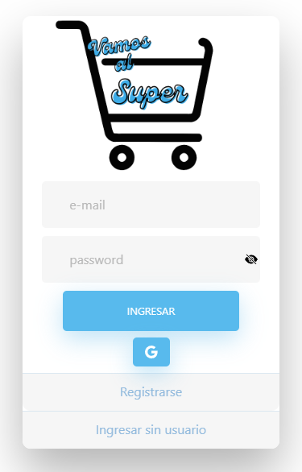
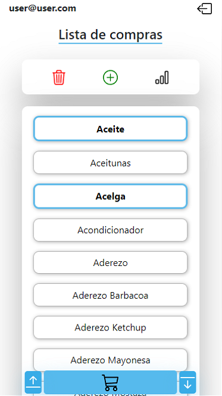
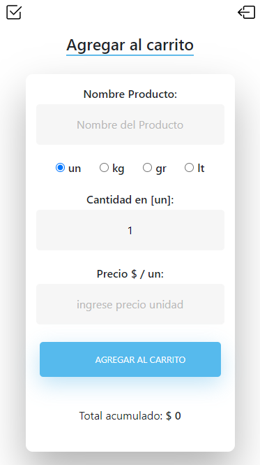
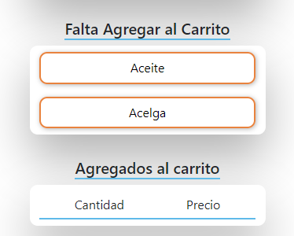
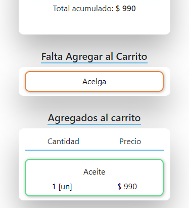
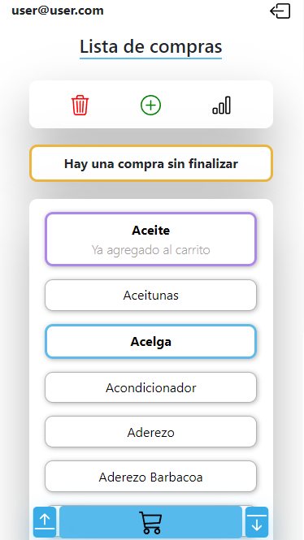

 

# Vamos al Super

Vamos al Super es un proyecto personal que consiste en una aplicación web diseñada especialmente para dispositivos móviles, y que permite gestionar fácilmente una lista de compras. La aplicación ofrece varias opciones para iniciar sesión y permite agregar, editar y eliminar productos de la lista de compras, así como gestionar el presupuesto asignando precios a los productos.
¡Prueba la aplicación haciendo [Click Aqui](https://vamos-al-supermercado.web.app/login)🚀!

En este proyecto se utilizaron las siguientes herramientas y tecnologías:

- `Angular` como framework.
- `TypeScript` como lenguaje de programación.
- `HTML` para la estructura de la página web.
- `CSS` para estilizar la página web.
- `NoSQL` como base de datos.
- `Firebase` para el despliegue y hosting.
- Buenas prácticas de `programación` y `seguridad` web.

 

---

## 🔎 Qué se puede hacer?
---

- Seleccionar productos para crear una lista de compras.
- Agregar, editar y eliminar productos del "carrito" y gestionar el presupuesto.
- Eliminar y agregar nuevos productos (Requiere inicio de sesión).
- Registrarse con e-mail y contraseña o con cuenta de Google.
- Iniciar sesión con usuario registrado o iniciar sin usuario (este último con funcionalidades limitadas).

 

## 🔎 Cómo funciona?
---
### Primera ventana: Inicio de sesión

 Para iniciar sesión en la aplicación puedes elegir varios métodos:

1. Iniciar sesión con e-mail y contraseña (Antes deberías registrarte si aún no lo has hecho).
2. Iniciar sesión con tu cuenta de Google haciendo clic en el icono de la `G`.
3. Si no deseas registrarte o iniciar sesión, puedes optar por "ingresar sin usuario" aunque con funcionalidades limitadas.

 

---
### Segunda ventana: Lista de compras

Cuando hayas iniciado sesión, se te redirigirá a la ventana de lista de compras donde se te mostrará una lista de productos generales que puedes agregar a tu lista de compras.

Con la lista puedes interactuar de varias formas:    

- Si presionas un producto cambiará de color, indicando que fue seleccionado como un producto de la lista de compras.
- Puedes agregar productos a la lista general haciendo clic en el botón `add`.
- Puedes eliminar productos de la lista general haciendo clic en el botón `trash`.
- Puedes ver estadísticas de las compras haciendo clic en el botón `stats` (actualmente en mantenimiento).

 

---
### Tercera ventana: Carrito

Cuando termines de seleccionar los productos que deseas agregar a la lista de compras y presiones el botón del carrito, se te redirigirá a esta ventana.

Aquí podrás gestionar la compra de los elementos agregados a la lista de compras.

Cuando hayas terminado la compra, debes presionar `finalizar` (arriba a la izquierda) para guardar y cerrar la compra. Si no se finaliza quedara abierta, ver sección [Lista de compras con compra sin finalizar](#lista-de-compras-con-compra-sin-finalizar)

Esta ventana se divide en 3 secciones:

- Sección para agregar productos con nombre, cantidad y precio.
    
    
 

- Sección de visualización de productos faltantes de agregar al carrito.
  
    
 

- Sección de visualización de productos agregados al carrito.
  
    
 

---
### Lista de compras (con compra sin finalizar)

Si existe una "lista de compras" sin finalizar, se indicará en esta sección, pudiendo volver a [Tercera ventana: Carrito ](#tercera-ventana-carrito) para finalizarla.

 

## 💎 Características en desarrollo

---

- Implementación de categorías para los productos. (Por ejemplo: Alimentos - Limpieza).

- Modo oscuro.
